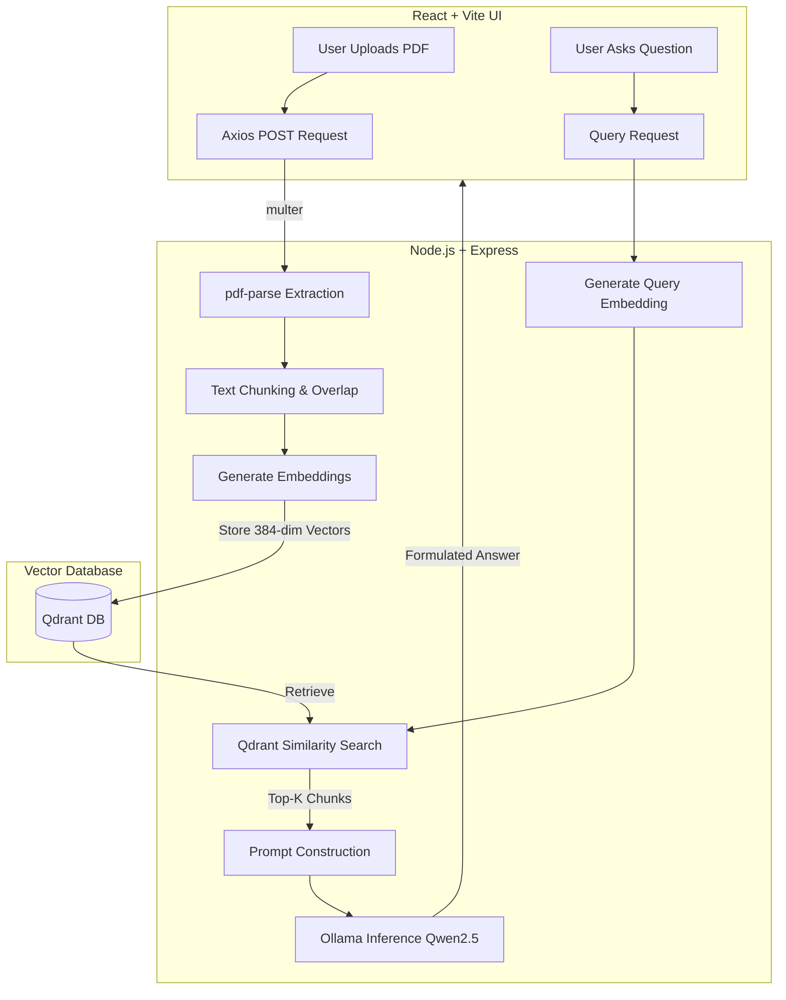

# 🐼 Panda AI: Privacy-First Local RAG Teaching Assistant


> A fully localized, privacy-preserving Retrieval-Augmented Generation (RAG) system designed to serve as an intelligent teaching assistant. Built to run entirely on user hardware without relying on cloud APIs, ensuring zero data leakage and offline capabilities.

## 📌 Problem Statement

Modern AI chatbots and study assistants rely heavily on cloud APIs (like OpenAI), which introduces several critical issues:
1. **Data Privacy Risks:** Uploading sensitive academic or personal materials to third-party servers.
2. **Hallucination:** Generic LLMs often fabricate facts when answering domain-specific queries.
3. **Context Blindness:** Inability to effectively reference users' specific study materials.
4. **Cloud Dependency:** High costs and inability to function offline.

## 💡 The Solution

**Panda AI** resolves these issues by implementing a **Local RAG architecture**. By utilizing local LLM inference engines (`Ollama`), robust vector databases (`Qdrant`), and high-quality optimized extraction parsing, the system securely indexes user-uploaded PDFs and generates accurate, context-aware responses **locally**.

## 🚀 Key Features

- **Document Grounding via RAG:** Upload PDFs and query the assistant. Responses are directly synthesized from the embedded text chunks, drastically reducing hallucinations.
- **Dual-Mode Inference:**
  - `RAG Mode`: Enforces strict retrieval-based answers from uploaded documents.
  - `Chat Mode`: Standard LLM conversational interface.
- **Semantic Vector Search:** Integrates Qdrant to perform rapid similarity-based retrieval over 384-dimensional text embeddings.
- **100% Privacy & Local Executions:** Zero telemetry. Zero API calls. Processes everything locally natively on low-resource hardware (runs on 8GB RAM).
- **Modern Responsive UI:** A streamlined React-based interface engineered for a seamless user experience.

## 🏗️ System Architecture



## 🛠️ Technology Stack

| Layer | Technologies |
| --- | --- |
| **Frontend** | React.js, Vite, Tailwind CSS, Axios |
| **Backend** | Node.js, Express.js, Multer, `pdf-parse` |
| **AI / ML** | Ollama, Qwen2.5 (1.5b-instruct), Local Embeddings (384-dim) |
| **Database** | Qdrant (Vector DB run via Docker) |
| **DevOps** | Docker, Docker Compose |

## ⚙️ Core Engineering Concepts Demonstrated

- **Retrieval-Augmented Generation (RAG):** End-to-end implementation from chunking strategies to context-injected prompt engineering.
- **Vector Space Modeling:** Creating, storing, and querying high-dimensional vector embeddings for semantic similarity.
- **Microservices & Containerization:** Decoupling vector database storage using Docker configurations.
- **Optimized LLM Inference:** Managing local LLM states efficiently without memory bloat using Ollama.
- **RESTful API Design:** Clean client-server separation using scalable Express controllers.

## 💻 Getting Started (Local Deployment)

### Prerequisites
- [Node.js](https://nodejs.org/) (v18+)
- [Docker & Docker Compose](https://www.docker.com/)
- [Ollama](https://ollama.ai/) installed locally

### Step-by-Step Installation

1. **Clone the repository**
   ```bash
   git clone https://github.com/yourusername/ai-virtual-teaching-assistant.git
   cd ai-virtual-teaching-assistant
   ```

2. **Spin up the Vector Database (Qdrant)**
   ```bash
   docker compose up -d
   ```

3. **Initialize the local LLM via Ollama**
   ```bash
   ollama pull qwen2.5:1.5b-instruct
   ollama serve
   ```

4. **Start the Backend Server**
   ```bash
   cd backend
   npm install
   node server.js
   ```

5. **Start the Frontend Application**
   ```bash
   cd ../frontend
   npm install
   npm run dev
   ```

The application will be running locally at `http://localhost:5173`.

## 📈 Future Roadmap

- [ ] **Voice Intelligence:** Whisper-based speech-to-text integration for vocal prompts.
- [ ] **Multi-modal RAG:** Support for OCR across scanned documents and images.
- [ ] **Adaptive Learning Profiles:** Persistent conversational memory spanning multiple study sessions.
- [ ] **Automated Quizzing:** Dynamic generation of MCQs directly derived from the vectorized chunks.

## 👨‍💻 Author

**Amit**  
*Final Year Computer Science Student*  
Passionate about System Design, Backend Engineering, and Applied AI. Open to Software Engineering and AI/ML roles.

---
*If this project helped you understand local RAG systems, dropping a ⭐ on the repository would be greatly appreciated!*
